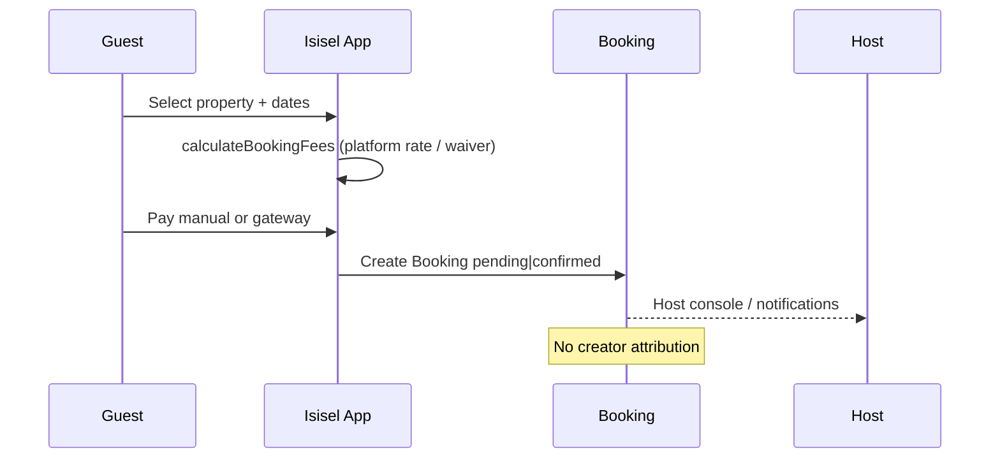
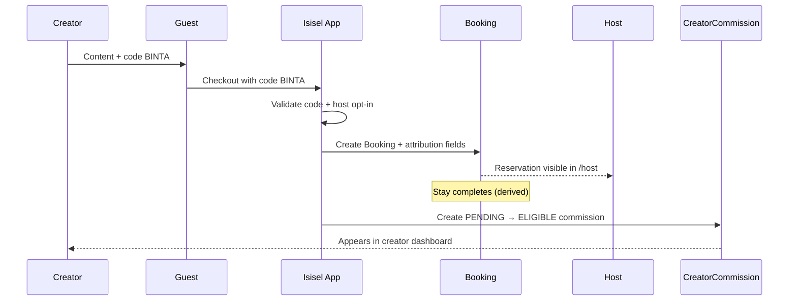
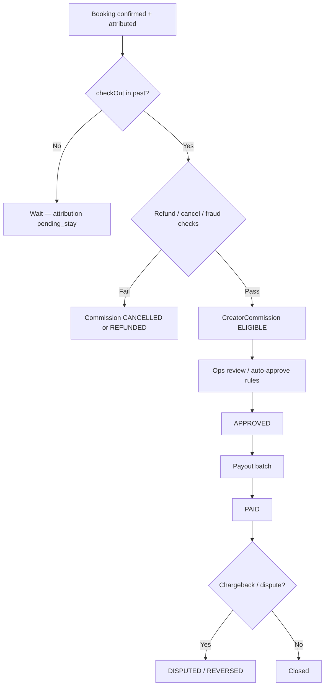
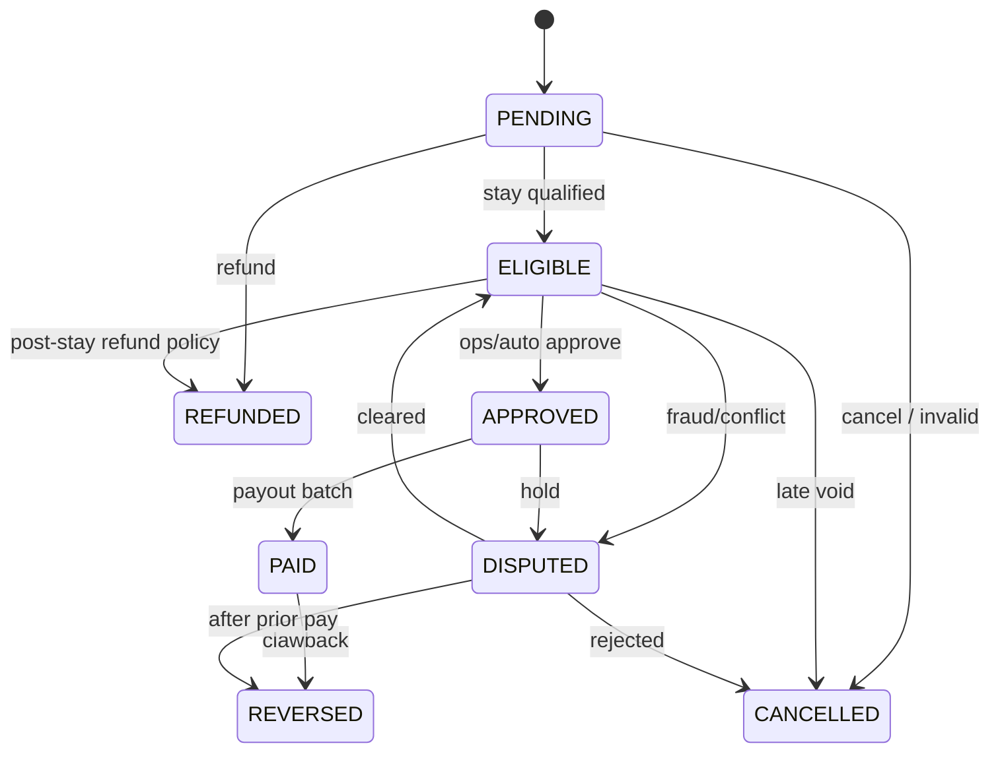

# Isisel Creator Partnership System

## Product & Business Specification

---

> ### Critical product principle
>
> **Isisel does not charge hosts a standard platform commission for this creator marketing model.**
>
> Hosts only share a percentage when they **voluntarily participate** in a creator campaign **and** that creator **actually generates a qualifying reservation**.
>
> **Creator commission is a marketing expense — not an Isisel platform take rate.**
>
> It must never be conflated with `pricingSnapshot.platformFee` / `commissionAmount` (guest service fee / Founding Host waiver ledger). Creator economics live in a **separate ledger**.

---

# 1. Cover / Document Control

| Field | Value |
|---|---|
| **Document** | Isisel Creator Partnership System |
| **ID** | ISEL-CPS-001 |
| **Version** | 1.0 |
| **Status** | Draft |
| **Product** | Isisel — Africa-focused property marketplace |
| **Site** | https://www.isisel.com |
| **App root** | `property_app/` (Next.js) |
| **Primary surfaces** | Public `/influencers`, Host `/host`, Ops `/ops/marketing/creators` |
| **Purpose** | Define the commercial model, guest/host/creator journeys, data architecture, commission engine, MVP scope, and integration points for a creator-led demand system |
| **Out of scope for this doc** | Final legal contracts, tax opinions, payment-provider KYC implementation details |

### Change log

| Version | Date | Notes |
|---|---|---|
| 1.0 | 2026-09-08 | Initial complete specification from codebase inspection + proposed commercial model |

### Legend used in this document

| Label | Meaning |
|---|---|
| **EXISTING** | Live or present in current codebase |
| **Proposed** | Not implemented; design for MVP / later phases |
| **Derived** | Computed from existing fields (no new status enum required at MVP) |

---

# 2. Executive Summary

Isisel is building an Africa-focused short-stay marketplace. Early growth depends less on paid ads and more on **trusted creators** who already influence travel decisions among diaspora and regional audiences.

Today Isisel has:

- A public creator funnel at **`/influencers`**
- Lead capture into MongoDB (`CreatorLead`, `CreatorFunnelEvent`)
- An ops CRM at **`/ops/marketing/creators`** with stages `new → contacted → discussing → proposed → negotiating → active → completed` (plus `not_fit`)
- A host console at **`/host`**
- A booking system with `pending | confirmed | cancelled` and a pricing snapshot that already tracks **platform** fees / Founding Host waivers

What Isisel **does not** have yet:

- Promo codes
- Booking attribution to creators
- Creator payouts
- Host opt-in to creator campaigns
- A separate creator-commission ledger

This specification defines a **Creator Partnership System** that adds those capabilities without changing Isisel’s host-friendly platform economics:

1. Creators may receive a **configurable fixed fee**, a **hosted stay**, and/or a **performance commission**.
2. Hosts **opt in** to creator promotion per property / campaign.
3. Guests book normally; optional promo codes attribute demand.
4. Creator commission **finalizes after the stay** (proposed), then enters a payout lifecycle.
5. Platform guest service fee (`PLATFORM_COMMISSION_RATE = 0.07` today) remains a **separate** concept from creator commission.

**Strategic outcome:** turn creator relationships from CRM leads into measurable, host-funded marketing that scales Gross Booking Value (GBV) while keeping Isisel’s platform take independent of creator spend.

---

# 3. Isisel Business Model

## 3.1 Marketplace role

Isisel connects:

- **Guests** seeking stays across African destinations
- **Hosts** listing homes, villas, and small hospitality inventory
- **Creators** (influencers) who introduce demand and, in some cases, hosts

## 3.2 How money moves today (EXISTING)

From `property_app/utils/propertyRates.js` and booking pricing:

| Component | Who pays / receives | Notes |
|---|---|---|
| Accommodation base | Guest → Host (via booking) | `pricingSnapshot.accommodationBase` |
| Cleaning fee | Guest | Default `CLEANING_FEE_RATE = 0.15` of base |
| Platform fee / commission | Guest-facing checkout fee | `PLATFORM_COMMISSION_RATE = 0.07` stored as `platformFee` / `commissionAmount` |
| Founding Host / override waiver | Reduces or zeros platform commission | `commissionWaived`, `commissionOverride`, `foundingHost` on `User` |
| Payment modes | `manual` or `gateway` | Manual often stays `pending`; gateway typically `confirmed` |

## 3.3 What this creator model deliberately is not

| Anti-pattern | Isisel position |
|---|---|
| Forced host platform take for “marketing” | **Rejected.** Hosts are not charged a standard platform commission for this model. |
| Bundling creator % into `platformFee` | **Rejected.** Separate ledger. |
| Paying creators for vanity metrics only | Prefer performance + hosted stay + optional fixed fee with clear deliverables. |
| Automatic opt-in of all hosts | **Rejected.** Host participation is voluntary. |

## 3.4 Restated principle

> **Isisel does not charge hosts a standard platform commission for this creator marketing model.**  
> Hosts only share a percentage when they voluntarily participate in a creator campaign and that creator actually generates a qualifying reservation.  
> **Creator commission is a marketing expense — not an Isisel platform take rate.**

---

# 4. Why Creator Partnerships

## 4.1 Market reality

For Africa-focused travel inventory, discovery often happens through:

- Diaspora creators (YouTube, TikTok, Instagram)
- Local lifestyle / travel voices
- Community trust, language, and cultural context that generic ads do not replicate cheaply

## 4.2 Product fit with current Isisel stack

Isisel already invested in creator **top-of-funnel** infrastructure:

| EXISTING piece | Path / model |
|---|---|
| Public landing | `/influencers` → `app/influencers/`, `components/creators/*` |
| Lead API | `POST /api/creators/leads` |
| Funnel events | `POST /api/creators/events` |
| CRM stages | `utils/creators/constants.js` |
| Ops UI | `/ops/marketing/creators` → `CreatorLeadsPanel.jsx` |
| Pitch collateral | `docs/kama-mvp-influencer-stay.html` |

The commercial gap is **attribution → commission → payout**. Closing that gap converts marketing relationships into an operable growth engine.

## 4.3 Dual value creation

| Party | Value |
|---|---|
| **Host** | Incremental bookings from creator audience; pays only on attributed success (plus optional hosted-stay inventory cost) |
| **Creator** | Cash (fixed + commission) and/or stay experience with clear content rights |
| **Guest** | Discoverable inventory via trusted recommendation; normal booking UX |
| **Isisel** | Supply + demand growth without inventing a coercive host take rate |

## 4.4 Why not only paid ads

Creator CAC can be structured as a mix of fixed + stay COGS + success commission. When campaigns perform, CAC as a % of GBV can remain competitive versus broad paid acquisition into nascent markets (see §23–§25).

---

# 5. Creator Compensation Model

Creators may be compensated with **one or more** of the following (all configurable per campaign / partnership):

## 5.1 Fixed fee (configurable)

| Attribute | Spec |
|---|---|
| Purpose | Guarantees basic compensation for deliverables (films, posts, stories, live sessions) |
| Config | Amount + currency + payment trigger (on contract / on content live / on campaign start) |
| Accounting | Marketing expense on Isisel or campaign budget owner (ops-configured) |
| Example | €200 fixed fee for a defined content package |

**Proposed:** Fixed fee is recorded on `CreatorCampaign` / `CreatorPayout` and is **not** deducted from host booking totals unless explicitly agreed as a host co-funded campaign.

## 5.2 Hosted stay

| Attribute | Spec |
|---|---|
| Purpose | Immersive content + authentic property storytelling |
| Form | Complimentary nights at a participating property (or Isisel-coordinated inventory) |
| Accounting | Opportunity cost / COGS for host or Isisel depending on who sponsors the stay |
| Example | 1 complimentary night at a €150 ADR property (see §6) |

## 5.3 Performance commission

| Attribute | Spec |
|---|---|
| Purpose | Align creator incentives with booked demand |
| Trigger | Qualifying attributed reservation that completes stay rules (§10, §19) |
| Rate | Configurable % of commission base (typically accommodation base) |
| Example | 10% via promo code `BINTA` |
| Payer | **Host marketing expense** when host has opted into the campaign |

### Critical separation

| Ledger | Field / system today | Creator commission |
|---|---|---|
| Platform guest fee | `pricingSnapshot.platformFee`, `commissionAmount`, `commissionWaived` | **Must not be reused** |
| Creator marketing | **Proposed** `CreatorCommission` collection | Independent amount, status, payout |

> Creator commission is a marketing expense — not an Isisel platform take rate.

## 5.4 Compensation stacks (typical packages)

| Package | Fixed | Hosted stay | Performance |
|---|---|---|---|
| Awareness | Optional small fixed | Optional | Low or none |
| Launch partner | Fixed | Yes | Medium % |
| Performance partner | Low/none | Optional | Higher % |
| Flagship (e.g. Binta) | €200 | 1 night | 10% for 90 days |

Packages are commercial templates; ops configures actual numbers per `CreatorCampaign` (**Proposed**).

---

# 6. Hosted Stay Model

## 6.1 Definition

A **Hosted Stay** is a complimentary (or heavily discounted) stay granted to a creator as part of a partnership, used for content production and authentic property exposure.

## 6.2 Proposed entity: `HostedStay`

| Field (proposed) | Description |
|---|---|
| `creatorProfileId` | Creator receiving the stay |
| `campaignId` | Optional link to campaign |
| `propertyId` | Property hosting the creator |
| `hostUserId` | Property owner (`Property.owner`) |
| `checkIn` / `checkOut` | Stay dates (`YYYY-MM-DD`, same convention as `Booking`) |
| `nights` | Derived |
| `status` | `proposed \| confirmed \| completed \| cancelled \| no_show` |
| `bookingId` | Optional link if represented as a special booking |
| `valueEstimate` | ADR × nights (for CAC accounting) |
| `contentDueAt` | Deliverable deadline |
| `notes` | Ops / host coordination |

## 6.3 Relationship to Booking (EXISTING)

Today bookings are `pending | confirmed | cancelled`. There is **no** `completed` status. Completed guest stays are **derived**: `status === "confirmed"` and `checkOut` in the past.

**Proposed options for hosted stays:**

1. **Preferred MVP:** Store `HostedStay` separately; optionally create a `Booking` with `source: "creator_hosted_stay"` (**new source enum value — Proposed**) and `amount: 0` / waived pricing for calendar blocking.
2. Do not invent a fake guest booking if calendar blocking can be done via host tools / availability blocks — but property calendars today are booking-driven, so a booking row is usually safer.

## 6.4 Who absorbs stay cost

| Sponsor | When |
|---|---|
| Host | Host opts into providing nights in exchange for content + future attributed bookings |
| Isisel | Strategic creator, market-opening stay, or host unavailable |
| Shared | Negotiated split recorded on campaign |

## 6.5 Deliverables tied to stay

Typical requirements (campaign-configured):

- Minimum content pieces (e.g. 1 long video + 3 shorts)
- Tagging / link / promo code mention
- Usage rights window for Isisel and host
- Disclosure compliance (platform ad guidelines)

---

# 7. Influencer Promo Code Model

## 7.1 Current state (EXISTING)

**No promo code system exists.** Greenfield.

Public `/influencers` and `CreatorLead` are lead capture only — **no** promo codes, **no** booking attribution, **no** creator payouts.

## 7.2 Proposed: `CreatorPromoCode`

| Field | Description |
|---|---|
| `code` | Unique uppercase string (e.g. `BINTA`) |
| `creatorProfileId` | Owner creator |
| `campaignId` | Campaign scope |
| `propertyIds` | Optional restriction to opted-in properties |
| `discountType` | `none \| percent \| fixed` (guest incentive optional) |
| `discountValue` | If guest discount offered |
| `commissionRate` | Creator performance rate for attributed bookings |
| `validFrom` / `validTo` | Window (e.g. 90 days) |
| `maxRedemptions` | Optional cap |
| `status` | `draft \| active \| paused \| expired \| revoked` |

## 7.3 Attribution rules (Proposed)

A booking is attributed when **all** of the following hold:

1. Guest applies a valid promo code at checkout (or follows a tracked campaign link that stamps the same code — Phase 2).
2. Code is `active` and within validity window at booking creation time.
3. Property is assigned / opted into the campaign (see §8, §17).
4. Booking later becomes a **qualifying** reservation under commission rules (§10, §19).

## 7.4 Guest discount vs creator commission

These are independent knobs:

| Knob | Effect |
|---|---|
| Guest discount | Reduces guest payable (funded by host, Isisel, or shared — configured) |
| Creator commission | Host marketing expense on qualifying attributed GBV base |

MVP may launch with **attribution-only codes** (`discountType: none`) to avoid discount funding complexity.

## 7.5 Code UX

**Proposed checkout addition:**

1. Optional “Have a creator code?” field on booking flow.
2. Validate via API against `CreatorPromoCode`.
3. Persist attribution on Booking (**Proposed** fields in §17–§18).
4. Show guest confirmation that code was applied (even if discount is 0%).

```text
Guest checkout
    │
    ▼
[ Optional promo code: BINTA ]
    │
    ├─ invalid → error, continue without attribution
    └─ valid → stamp booking.attribution + optional discount
```

---

# 8. Host Economics

## 8.1 Principle (repeat)

> **Isisel does not charge hosts a standard platform commission for this creator marketing model.**  
> Hosts only share a percentage when they voluntarily participate in a creator campaign and that creator actually generates a qualifying reservation.  
> **Creator commission is a marketing expense — not an Isisel platform take rate.**

## 8.2 Opt-in model (Proposed)

Hosts must explicitly opt in before their properties can be promoted under a creator campaign.

| Opt-in level | Meaning |
|---|---|
| Property + campaign | Host accepts creator X promoting property Y under campaign Z at rate R |
| Default off | Properties not opted in cannot be attributed / commissioned |

**Proposed storage:** `CreatorPropertyAssignment` with `hostAcceptedAt`, `commissionRate`, `status`.

## 8.3 What the host pays

| Scenario | Host pays |
|---|---|
| No creator involvement | €0 creator commission |
| Creator content but no attributed booking | €0 performance commission (may still provide hosted stay if agreed) |
| Attributed qualifying booking | Agreed % of commission base (e.g. 10% of accommodation base) |
| Platform guest fee | Unrelated; still governed by Founding Host / override / standard checkout fee rules |

## 8.4 Worked micro-example (€200 villa night)

Assume:

- 1 night villa, accommodation base **€200**
- Guest cleaning fee and platform fee calculated as today (illustrative; currency may be USD in production snapshots)
- Host opted into `BINTA` at **10%** creator commission
- Booking attributed to `BINTA` and stay completes

| Line | Amount | Ledger |
|---|---|---|
| Accommodation base | €200 | Host revenue base |
| Creator commission (10%) | €20 | **CreatorCommission** (marketing expense) |
| Platform fee (if applicable) | Separate | `pricingSnapshot.platformFee` — **not** creator |

Host keeps accommodation minus any agreed creator commission settlement mechanism (invoice / payout deduction / host bill — ops policy). Platform fee remains orthogonal.

## 8.5 Founding Host interaction

Founding Hosts may have **0% platform commission** via `foundingHost` / `commissionOverride` (**EXISTING**). That waiver **does not** auto-waive creator commission. Creator commission remains a voluntary marketing choice.

---

# 9. Booking Flow

## 9.1 Without influencer (EXISTING behavior + unchanged economics)



```text
Guest → Property page → Dates → Fees (base + cleaning + platformFee)
      → paymentMode manual|gateway
      → Booking status pending|confirmed
      → Host sees reservation in /host
      → (Later) stay ends when checkOut is past + confirmed  [DERIVED completed]
```

## 9.2 With influencer (Proposed)



```text
Creator publishes content with promo code
    → Guest books opted-in property with code
    → Booking stores attribution (creatorId, campaignId, code, rate snapshot)
    → Platform fee calculated as TODAY (unchanged ledger)
    → Creator commission NOT taken at checkout from platformFee
    → After stay qualification → CreatorCommission row
```

### Attribution stamp at booking time (Proposed)

Snapshot the commercial terms on the booking so later rate edits do not rewrite history:

- `creatorPromoCode`
- `creatorProfileId`
- `creatorCampaignId`
- `creatorCommissionRate`
- `creatorCommissionBase` (e.g. accommodation base)
- `creatorAttributionStatus` (`pending_stay | eligible | rejected | cancelled`)

---

# 10. Commission Flow (After Stay)

## 10.1 Why after stay (Proposed)

Commission should finalize **after** the stay to reduce:

- No-shows / early cancellations paid out incorrectly
- Refund disputes
- Manual payment bookings that never convert to real stays

**EXISTING constraint:** There is no `completed` booking status. Qualification is **derived**:

```text
qualifyingStay =
  booking.status === "confirmed"
  && booking.checkOut < today
  && not fully refunded (policy)
  && attribution present
  && host assignment still valid at booking time (snapshot)
```

## 10.2 End-to-end commission flow



## 10.3 Timing policy (Proposed defaults)

| Event | Timing |
|---|---|
| Attribution recorded | Booking creation |
| Eligibility evaluation | Daily job after `checkOut` date (property local date) |
| Holdback | Optional N days after checkout (Phase 2) |
| Ops approval | Manual for MVP; automated thresholds later |
| Payout | Weekly / biweekly batch |

## 10.4 Independence from platform fee

Even if `commissionWaived: true` on the booking (Founding Host), creator commission can still be ELIGIBLE if the host opted into the campaign. Different ledgers, different payers, different meanings.

---

# 11. Creator Journey

```text
Discover Isisel
   → /influencers (EXISTING)
   → Submit CreatorLead (EXISTING CRM)
   → Ops moves stages: new → … → active (EXISTING)
   → [Proposed] Convert lead → CreatorProfile
   → Sign partnership terms
   → Receive campaign + promo code + optional hosted stay
   → Publish content
   → Track bookings / commissions in Creator Dashboard
   → Receive payouts
   → Campaign completed / renew
```

| Stage | EXISTING / Proposed | System touchpoint |
|---|---|---|
| Awareness | EXISTING | `/influencers` |
| Lead | EXISTING | `POST /api/creators/leads`, `CreatorLead` |
| CRM nurturing | EXISTING | `/ops/marketing/creators` |
| Profile & KYC-lite | Proposed | `CreatorProfile` |
| Campaign live | Proposed | `CreatorCampaign`, `CreatorPromoCode` |
| Hosted stay | Proposed | `HostedStay` |
| Performance | Proposed | Booking attribution + `CreatorCommission` |
| Payout | Proposed | `CreatorPayout` |
| Close / renew | EXISTING stage + Proposed analytics | CRM stage `completed` |

---

# 12. Host Journey

```text
Host verified on Isisel (/host) — EXISTING
   → Sees Marketing / Creator Partnerships (Proposed)
   → Reviews campaign invite (creator, rate, window, properties)
   → Opts in / declines per property
   → Optional: offers hosted stay nights
   → Receives attributed bookings like normal reservations
   → Sees creator marketing expense estimates
   → Settles creator commission per payout policy
```

### Host opt-in checklist (Proposed UX)

1. Which creator / campaign?
2. Which listings?
3. Commission % and base definition
4. Date window
5. Guest discount funding (if any)
6. Hosted stay contribution (nights)
7. Content usage rights acknowledgment
8. Confirm: this is a marketing expense, not a platform take rate

---

# 13. Guest Journey

Guests should feel a normal Isisel booking with one optional addition.

```text
See creator content
  → Land on property or search on isisel.com
  → Select dates
  → (Optional) Enter promo code
  → See total (base + cleaning + platform fee ± discount)
  → Pay manual or gateway (EXISTING paymentMode)
  → Receive confirmation
  → Stay
```

### Guest principles

- No requirement to understand creator economics
- Promo code field is optional and forgiving
- Platform fee display remains consistent with current fee logic
- Creator commission is **not** shown as an extra guest line item

---

# 14. Creator Dashboard (Wireframe Description)

**Proposed** surface (creators authenticated; may start as ops-exported statements in MVP).

```text
┌─────────────────────────────────────────────────────────────┐
│ Isisel · Creator                          [Binta Lola Camara]│
├──────────────┬──────────────────────────────────────────────┤
│ Overview     │  Campaign: Dakar Villas Launch               │
│ Campaigns    │  Code: BINTA · Active · 54 days left         │
│ Codes        │                                              │
│ Bookings     │  ┌────────┐ ┌────────┐ ┌────────┐ ┌────────┐ │
│ Commissions  │  │ Clicks*│ │ Booked │ │ GBV    │ │ Earn.  │ │
│ Stays        │  │  —     │ │  20    │ │ €5,000 │ │ €700   │ │
│ Payouts      │  └────────┘ └────────┘ └────────┘ └────────┘ │
│ Profile      │                                              │
│              │  Compensation mix                            │
│              │  • Fixed fee: €200 (Paid/Pending)            │
│              │  • Hosted stay: 1 night (Completed)          │
│              │  • Commission: €500 ELIGIBLE/APPROVED        │
│              │                                              │
│              │  Recent attributed bookings                  │
│              │  #…  Villa X  €200  10%  ELIGIBLE            │
│              │  #…  Villa Y  €180  10%  PENDING (in stay)   │
└──────────────┴──────────────────────────────────────────────┘
* Click tracking = Phase 2
```

### Screens

| Screen | Purpose |
|---|---|
| Overview | Earnings summary, active campaigns |
| Campaigns | Deliverables, windows, status |
| Codes | Promo codes + copy helpers |
| Bookings | Attributed reservations (limited PII) |
| Commissions | Status pipeline |
| Stays | HostedStay schedule + content due |
| Payouts | Payment history |
| Profile | Platforms, payout method, tax form status |

---

# 15. Host Dashboard (Marketing / Creator Partnerships)

**Proposed** addition under host console (`/host` — EXISTING shell).

```text
/host → Marketing → Creator Partnerships

┌─────────────────────────────────────────────────────────────┐
│ Creator Partnerships                                        │
│ Reminder: Creator commission is a marketing expense —       │
│ not an Isisel platform take rate. Opt-in only.              │
├─────────────────────────────────────────────────────────────┤
│ Invites                                                     │
│  • Binta · 10% · 90 days · 2 properties      [Review]       │
│                                                             │
│ Active assignments                                          │
│  Property          Creator   Rate   Window      Attributed  │
│  Villa Teranga     BINTA     10%    Sep–Dec     8 bookings  │
│                                                             │
│ Marketing spend (creator)                                   │
│  Pending stay: €40 · ELIGIBLE: €120 · PAID: €80             │
│                                                             │
│ Hosted stays you offered                                    │
│  1 night · Binta · 12–13 Oct · content due 20 Oct           │
└─────────────────────────────────────────────────────────────┘
```

### Host requirements

- Clear opt-in / opt-out
- Per-property controls
- Estimate of creator marketing expense vs incremental GBV
- No confusion with Founding Host platform fee waiver

---

# 16. Admin Dashboard (Ops → Creator Partnerships)

## 16.1 EXISTING

| Path | Capability |
|---|---|
| `/ops` | Operations console |
| `/ops/marketing` | Marketing section (OpsNav) |
| `/ops/marketing/creators` | CreatorLead CRM (`CreatorLeadsPanel.jsx`) |
| Stages | `new → contacted → discussing → proposed → negotiating → active → completed` / `not_fit` |

## 16.2 Proposed expansion

Extend Marketing → **Creator Partnerships** beyond leads:

```text
/ops/marketing/creators
  ├── Leads (EXISTING CRM)
  ├── Profiles (Proposed)
  ├── Campaigns (Proposed)
  ├── Promo Codes (Proposed)
  ├── Host Assignments (Proposed)
  ├── Hosted Stays (Proposed)
  ├── Commissions queue (Proposed)
  ├── Payouts (Proposed)
  └── Analytics (Proposed)
```

### Ops commission queue wireframe

```text
Commissions · Needs review
 Filter: ELIGIBLE | DISPUTED | …

 Booking   Creator   Host   Base    Rate   Amount   Stay end   Actions
 …         BINTA     …      €200    10%    €20      2026-09-01 [Approve]
```

Ops can transition statuses per §21 with audit trail (align with existing `AuditLog` patterns where applicable).

---

# 17. Database Architecture

## 17.1 EXISTING models (do not reinvent)

| Model | File | Relevant facts |
|---|---|---|
| `Booking` | `models/Booking.js` | `status: pending\|confirmed\|cancelled`; `pricingSnapshot` with `platformFee`, `commissionAmount`, `commissionWaived`, `accommodationBase`, `cleaningFee`, `total`, `nights`, `currency`; `paymentMode: manual\|gateway` |
| `Property` | `models/Property.js` | `owner` string; `status: pending\|approved\|rejected` |
| `User` | `models/User.js` | `role: guest\|host\|admin\|superadmin`; `hostStatus`; `foundingHost`; `commissionOverride` |
| `CreatorLead` | `models/CreatorLead.js` | Lead capture + CRM stages |
| `CreatorFunnelEvent` | `models/CreatorFunnelEvent.js` | Funnel analytics for `/influencers` |

## 17.2 Proposed models

### `CreatorProfile`

| Field | Type / notes |
|---|---|
| `userId` | Optional link to User |
| `leadId` | Optional link to CreatorLead |
| `displayName` | string |
| `platforms` | array (reuse `CREATOR_PLATFORMS` ideas) |
| `profileUrls` | array |
| `country` | string |
| `status` | `invited\|active\|suspended\|archived` |
| `payoutMethod` | opaque / provider ref |
| `notes` | ops |

### `CreatorCampaign`

| Field | Type / notes |
|---|---|
| `name` | string |
| `creatorProfileId` | ref |
| `fixedFeeAmount` / `fixedFeeCurrency` | optional |
| `hostedStayNights` | number |
| `defaultCommissionRate` | number 0–1 |
| `startsAt` / `endsAt` | dates |
| `status` | `draft\|active\|paused\|completed\|cancelled` |
| `deliverables` | structured list |
| `termsVersion` | string |

### `CreatorPromoCode`

See §7.2.

### `CreatorPropertyAssignment`

| Field | Type / notes |
|---|---|
| `campaignId` | ref |
| `propertyId` | ref |
| `hostUserId` | from `Property.owner` |
| `commissionRate` | may override campaign default |
| `status` | `invited\|accepted\|declined\|revoked\|expired` |
| `hostAcceptedAt` | date |
| `validFrom` / `validTo` | optional |

### `CreatorCommission`

| Field | Type / notes |
|---|---|
| `bookingId` | unique attribution target |
| `creatorProfileId` | ref |
| `campaignId` | ref |
| `propertyId` | ref |
| `hostUserId` | ref/string |
| `currency` | string |
| `commissionBase` | number (typically accommodationBase) |
| `commissionRate` | number |
| `commissionAmount` | number |
| `status` | see §21 |
| `qualifiesAt` | date |
| `notes` / `disputeReason` | string |

**Important:** Do **not** write creator amounts into `Booking.pricingSnapshot.platformFee`.

### `CreatorPayout`

| Field | Type / notes |
|---|---|
| `creatorProfileId` | ref |
| `commissionIds` | array |
| `fixedFeeComponents` | optional |
| `grossAmount` | number |
| `currency` | string |
| `status` | subset of payout lifecycle |
| `paidAt` | date |
| `providerRef` | string |

### `HostedStay`

See §6.2.

## 17.3 Proposed Booking field additions

Additive fields on `Booking` (or subdocument `creatorAttribution`):

| Field | Purpose |
|---|---|
| `creatorPromoCode` | Code string used |
| `creatorProfileId` | Attribution |
| `creatorCampaignId` | Attribution |
| `creatorCommissionRate` | Snapshot |
| `creatorCommissionBase` | Snapshot |
| `creatorAttributionStatus` | Lifecycle hint |

## 17.4 ER-style overview

```text
CreatorLead (EXISTING)
    │ convert
    ▼
CreatorProfile ──┬── CreatorCampaign ──┬── CreatorPromoCode
                 │                     ├── CreatorPropertyAssignment ── Property (EXISTING)
                 │                     └── HostedStay ── Property
                 │
                 ├── CreatorCommission ── Booking (EXISTING, attributed)
                 └── CreatorPayout ────── CreatorCommission[]

User (EXISTING host) ── owns ── Property
User foundingHost / commissionOverride ── affects ONLY platformFee ledger
```

---

# 18. Technical Architecture

## 18.1 Integration with EXISTING systems

| Area | Integration point | Notes |
|---|---|---|
| Fees | `utils/propertyRates.js` → `PLATFORM_COMMISSION_RATE`, `calculateBookingFees` | Unchanged for creator MVP; do not overload |
| Founding Host | `utils/foundingHost/logic.js` | Platform waiver only |
| Booking create / pay | booking API routes + `finalizePaidTransaction` | Add promo validation + attribution stamp |
| Host UI | `app/host/*`, `components/host/*` | New Marketing section |
| Ops UI | `app/ops/marketing/creators`, `CreatorLeadsPanel.jsx` | Extend nav / panels |
| Public creators | `app/influencers`, `components/creators/*` | Keep lead funnel; link to “partners” later |
| Constants | `utils/creators/constants.js` | Extend carefully; keep CRM stages stable |
| Email | `utils/email/*`, `utils/creators/notify.js` | Notify on assignment / payout |
| Auth roles | `User.role` | Creators may be `guest` users with CreatorProfile link; ops remain `admin`/`superadmin` |

## 18.2 Proposed service modules

```text
property_app/
  models/
    CreatorProfile.js          (Proposed)
    CreatorCampaign.js         (Proposed)
    CreatorPromoCode.js        (Proposed)
    CreatorPropertyAssignment.js (Proposed)
    CreatorCommission.js       (Proposed)
    CreatorPayout.js           (Proposed)
    HostedStay.js              (Proposed)
  utils/creators/
    constants.js               (EXISTING — extend)
    attribution.js             (Proposed)
    commissionEngine.js        (Proposed)
    payout.js                  (Proposed)
  app/api/creators/
    leads/                     (EXISTING)
    events/                    (EXISTING)
    promo/validate/            (Proposed)
    commissions/               (Proposed)
    payouts/                   (Proposed)
  app/api/host/marketing/      (Proposed)
  app/ops/marketing/creators/  (EXISTING + Proposed panels)
```

## 18.3 Job / cron (Proposed)

| Job | Responsibility |
|---|---|
| `evaluateCreatorCommissions` | Mark PENDING → ELIGIBLE after derived completed stay |
| `expirePromoCodes` | Flip expired codes |
| `campaignWindowGuard` | Pause assignments outside window |

## 18.4 Explicit non-goals for architecture

- Do not reuse `pricingSnapshot.commissionAmount` for creator pay
- Do not require a new Booking `completed` status for MVP (derive it)
- Do not force all hosts into campaigns

---

# 19. Commission Engine

## 19.1 Inputs

- Attributed `Booking`
- Snapshot rate + base
- Refund / cancel state
- Fraud signals (§20)
- Assignment validity at booking time

## 19.2 Base definition (Proposed default)

```text
commissionBase = booking.pricingSnapshot.accommodationBase
commissionAmount = round(commissionBase * creatorCommissionRate, currency decimals)
```

Cleaning fee and platform fee are **excluded** by default from creator commission base (configurable later if partners demand otherwise).

## 19.3 State machine (summary)

See full statuses in §21. Engine responsibilities:

1. On attributed booking create → ensure `CreatorCommission` with `PENDING` (or delay row creation until checkout — either works; prefer create-at-booking for auditability).
2. On cancel before stay → `CANCELLED`
3. On refund after pay → `REFUNDED` or partial adjustment rules
4. After derived completed stay + checks → `ELIGIBLE`
5. Ops/auto → `APPROVED`
6. Payout execution → `PAID`
7. Exception paths → `DISPUTED` / `REVERSED`

## 19.4 Pseudocode

```text
function evaluateCommission(commissionId):
  booking = load booking
  if booking.status == cancelled: return CANCELLED
  if refundStatus indicates full refund: return REFUNDED
  if booking.status != confirmed: keep PENDING
  if checkOut >= today: keep PENDING
  if fraudFlag: return DISPUTED
  amount = snapshot amount
  mark ELIGIBLE (amount, qualifiesAt=now)
```

## 19.5 Idempotency

- Unique index on `CreatorCommission.bookingId`
- Payout batches reference commission IDs; a commission cannot be in two open payouts
- Webhook retries must not double-create attribution

---

# 20. Fraud Prevention

## 20.1 Risks

| Risk | Example |
|---|---|
| Self-booking | Creator books own stay to earn commission |
| Host–creator collusion | Low-value cycling bookings |
| Code leakage | Public code used outside intended audience (acceptable commercially; monitor abuse) |
| Fake manual bookings | `paymentMode: manual` never paid but marked confirmed incorrectly |
| Refund abuse | Book → commission path → refund |
| Training noise | `source: ops_training` bookings (**EXISTING**) must be excluded |

## 20.2 Controls (Proposed)

1. Exclude `source: "ops_training"` from attribution.
2. Block attribution when `guestId` matches creator linked user, or guest email matches creator email.
3. Require `confirmed` + past `checkOut` before ELIGIBLE.
4. Cap commissions per creator–host pair per rolling window.
5. Velocity alerts (ops dashboard).
6. Manual review queue above thresholds (amount or count).
7. Promo code property allowlist via assignments only.
8. Audit log on status transitions.

## 20.3 Manual payment caution

Because `paymentMode: manual` bookings may remain `pending`, commission engine must **not** treat pending manual holds as completed stays. Only `confirmed` enters eligibility path.

---

# 21. Payout Lifecycle + Statuses

Canonical commission / payout-related statuses:

| Status | Meaning |
|---|---|
| `PENDING` | Attributed; stay not yet qualified |
| `ELIGIBLE` | Stay qualified; awaiting approval / batching |
| `CANCELLED` | Booking cancelled or attribution void before pay |
| `REFUNDED` | Booking refund voided commission |
| `APPROVED` | Ops/system approved for payout |
| `PAID` | Funds sent to creator |
| `DISPUTED` | Under investigation |
| `REVERSED` | Clawback after paid |



### Fixed fee payouts

Fixed fees may use the same `CreatorPayout` mechanism with line items typed `fixed_fee` vs `performance_commission`, without requiring a Booking.

---

# 22. Campaign Analytics

## 22.1 EXISTING

- Creator funnel events on `/influencers` (`CreatorFunnelEvent`, event names in `CREATOR_FUNNEL_EVENTS`)
- Ops analytics elsewhere for platform economics (`utils/opsAnalytics/*`) — platform fee focused

## 22.2 Proposed campaign KPIs

| KPI | Definition |
|---|---|
| Attributed bookings | Count of attributed bookings |
| Attributed GBV | Sum of accommodation base (or total — define consistently) |
| Creator commission incurred | Sum ELIGIBLE/APPROVED/PAID |
| Fixed fee spend | Sum paid fixed fees |
| Hosted stay COGS | Estimated ADR × nights |
| Net campaign CAC | fixed + stay COGS + commission |
| CAC / GBV | Net campaign CAC ÷ attributed GBV |
| Conversion | Phase 2 with link clicks |
| Content delivery | Deliverables completed / due |

## 22.3 Dashboards

- Creator: personal performance
- Host: marketing ROI on opted-in properties
- Ops: portfolio of campaigns, outliers, fraud queue

---

# 23. Creator CAC

## 23.1 Definition

```text
Creator CAC = Fixed fee + Hosted stay COGS + Performance commissions paid/owed
CAC % of GBV = Creator CAC / Attributed GBV
```

## 23.2 Example (aligned with §24–§25)

| Component | Amount |
|---|---|
| Fixed fee | €200 |
| Hosted stay COGS | €150 |
| Performance commission | €500 |
| **Creator CAC** | **€850** |
| Attributed GBV | €5,000 |
| **CAC / GBV** | **17%** |

Interpretation: for this campaign outcome, Isisel/hosts spent €0.17 in creator marketing per €1 of attributed accommodation GBV — before considering repeat guests, content residual value, and supply-side branding.

## 23.3 Comparison note

CAC % should be compared carefully to paid social CAC in target corridors. Residual content value (evergreen video) is **not** fully captured in the 17% snapshot.

---

# 24. Example: Binta Lola Camara

Illustrative flagship partnership (commercial example for planning — not a live contract in code).

## 24.1 Package

| Term | Value |
|---|---|
| Creator | Binta Lola Camara |
| Promo code | `BINTA` |
| Fixed fee | €200 |
| Hosted stay | 1 night |
| Performance | 10% of accommodation base |
| Window | 90 days |
| Host participation | Opt-in only |

## 24.2 Outcome scenario

| Metric | Value |
|---|---|
| Attributed bookings | 20 |
| Average accommodation base | €250 |
| Attributed GBV | 20 × €250 = **€5,000** |
| Commission (10%) | **€500** |
| Fixed fee | **€200** |
| Hosted stay (est.) | **€150** |
| Creator cash earnings | €200 + €500 = **€700** (+ stay) |
| Total creator marketing cost | **€850** |
| CAC / GBV | **17%** |

## 24.3 Per-booking vignette (€200 villa)

| Item | Amount |
|---|---|
| Villa accommodation | €200 |
| Creator commission @ 10% | €20 |
| Platform fee | Per EXISTING fee engine (separate) |

If 10 of the 20 bookings were €200 bases: contribution `10 × €20 = €200` toward the €500 commission total (remaining bookings at higher bases).

## 24.4 Narrative for partners

Binta receives a modest fixed fee and a hosted night to produce authentic content, then earns only when hosts who opted in receive real attributed demand. Isisel’s platform fee rules (including Founding Host waivers) remain untouched.

> Creator commission is a marketing expense — not an Isisel platform take rate.

---

# 25. Example Campaign Economics

## 25.1 Summary table (Binta-style)

| Line item | Amount (€) | Payer / bearer |
|---|---|---|
| Fixed fee | 200 | Campaign budget (Isisel or co-funded) |
| Hosted stay COGS | 150 | Host and/or Isisel |
| Performance commissions | 500 | Opted-in hosts (marketing expense) |
| **Total creator cost** | **850** | Mixed |
| Attributed GBV | 5,000 | Guests → hosts |
| Creator CAC / GBV | 17% | — |

## 25.2 Host view for one opted-in property

Assume one host received 8 attributed bookings averaging €250 base:

| | |
|---|---|
| Host GBV | €2,000 |
| Creator commission @ 10% | €200 |
| Net before other costs | €1,800 accommodation |
| Platform fee impact | Unchanged vs non-creator booking path |

## 25.3 Sensitivity

| Attributed GBV | Commission 10% | Fixed+Stay | Total CAC | CAC/GBV |
|---|---|---|---|---|
| €2,000 | €200 | €350 | €550 | 27.5% |
| €5,000 | €500 | €350 | €850 | 17.0% |
| €10,000 | €1,000 | €350 | €1,350 | 13.5% |

Performance improves CAC efficiency as GBV scales — the core reason to prefer commission-weighted packages for proven creators.

## 25.4 Platform fee vs creator commission (side-by-side)

| | Platform fee (EXISTING) | Creator commission (Proposed) |
|---|---|---|
| Purpose | Marketplace checkout fee | Marketing attribution reward |
| Default rate | 7% (`PLATFORM_COMMISSION_RATE`) | Campaign-configured (e.g. 10%) |
| Stored on booking | `pricingSnapshot.platformFee` | Attribution + `CreatorCommission` |
| Waived by Founding Host? | Yes possible | No automatic waiver |
| Host mandatory? | Fee policy at checkout | **Opt-in only** |
| When finalized | At booking fee calculation | After stay (proposed) |

---

# 26. Legal / Commercial Considerations (Not Legal Advice)

This section flags topics for counsel and commercial ops. It is **not legal advice**.

| Topic | Consideration |
|---|---|
| Influencer disclosure | Creators must follow platform advertising disclosure rules |
| Contract | Fixed fee, stay, commission base, window, content rights, exclusivity |
| Host terms | Opt-in marketing addendum clarifying creator commission ≠ platform fee |
| Privacy | Guest PII minimization in creator dashboards |
| Tax / invoicing | Creator invoices, withholding, local tax treatment |
| Consumer pricing | Clear guest totals; avoid misleading “discount” claims |
| IP / usage | License for Isisel and host to reuse content |
| Liability | Property damage during hosted stays; insurance |
| Payment compliance | KYC for payouts; sanctions screening as required |
| Refunds | Contractual rules for commission reversal |
| Governing law | To be set in partnership agreements |

Commercial messaging must consistently state:

> Isisel does not charge hosts a standard platform commission for this creator marketing model…

---

# 27. MVP Scope

## 27.1 Goals

Ship the smallest system that makes creator partnerships **operable and attributable**.

## 27.2 In MVP

| Item | Notes |
|---|---|
| Convert `CreatorLead` → `CreatorProfile` (ops action) | Proposed |
| `CreatorCampaign` with fixed fee + rate + window | Proposed |
| `CreatorPromoCode` (attribution-first; discount optional/off) | Proposed |
| `CreatorPropertyAssignment` host opt-in | Proposed |
| Booking attribution fields | Proposed |
| `CreatorCommission` engine with after-stay eligibility | Proposed |
| Statuses: PENDING → ELIGIBLE → APPROVED → PAID (+ cancel/refund) | Proposed |
| Ops panels under `/ops/marketing/creators` | Extend EXISTING |
| Host Marketing page under `/host` | Proposed |
| Basic statements for creators (even CSV / email) | Proposed |
| Exclude training bookings | EXISTING `source: ops_training` |
| Keep platform fee engine untouched | EXISTING |

## 27.3 Explicitly out of MVP

| Item | Phase |
|---|---|
| Public creator self-serve marketplace | §29 |
| Deep link click graph / multi-touch attribution | Phase 2 |
| Complex guest-funded discount pools | Phase 2 |
| Automatic payout rails to all countries | Phase 2 |
| In-app creator social inbox | Future |
| Changing Booking status enum to include `completed` | Optional later; derive for now |
| Merging creator amounts into `platformFee` | Never |

## 27.4 MVP success criteria

1. At least one live campaign with host opt-ins and a real promo code.
2. Attributed bookings visible in ops and host views.
3. Commission rows reach ELIGIBLE after stay without touching platform fee fields.
4. Clear reporting of creator CAC vs GBV.

---

# 28. Phase 2 Features

| Feature | Description |
|---|---|
| Tracked campaign links | Attribution without manual code entry |
| Guest discounts | Configurable funding (host / Isisel / shared) |
| Holdback period | N days post-checkout before ELIGIBLE |
| Auto-approval rules | Low-risk commissions skip manual ops |
| Creator dashboard login | Full self-serve UI (§14) |
| Payout providers | Localized payout methods |
| Content deliverable tracker | Upload proofs, AI/ops review |
| A/B creative analytics | Tie content pieces to bookings |
| Multi-property smart codes | Geo / collection targeting |
| Host ROI scoring | Recommend opt-in for likely winners |
| Dispute workflow UI | Structured evidence for DISPUTED |
| Partial refund pro-rata commission | Automated adjustments |

---

# 29. Future Creator Marketplace

Long-term vision: hosts browse vetted creators; creators browse opted-in inventory; matching becomes marketplace-like.

```text
Today (EXISTING)
  Lead capture + CRM

MVP (Proposed)
  Ops-orchestrated campaigns + codes + opt-in + commissions

Phase 2
  Self-serve dashboards + tracked links + payouts automation

Future marketplace
  Host↔Creator discovery
  Bid / apply flows
  Standardized packages
  Ratings / reliability scores
  Escrowed marketing budgets
```

Principles that must survive marketplace scale:

1. Host opt-in remains mandatory.
2. Creator commission remains a marketing expense ledger.
3. Platform fee ledger remains separate.
4. After-stay qualification remains the default trust mechanism unless escrow redesigns it deliberately.

---

# 30. Conclusion

Isisel already has the **relationship funnel** for creators (`/influencers`, `CreatorLead`, ops CRM). The Creator Partnership System extends that funnel into a **measurable commercial engine**: promo codes, host opt-in, attribution, after-stay commission, and payouts.

The economic story is intentionally host-friendly and investor-clear:

> **Isisel does not charge hosts a standard platform commission for this creator marketing model.**  
> Hosts only share a percentage when they voluntarily participate in a creator campaign and that creator actually generates a qualifying reservation.  
> **Creator commission is a marketing expense — not an Isisel platform take rate.**

Engineering must preserve that distinction in data design: never conflate creator pay with `pricingSnapshot.platformFee` / Founding Host waivers. MVP should integrate with existing `Booking`, `Property`, `User`, `/host`, and `/ops/marketing/creators` surfaces, while treating promo codes and creator ledgers as greenfield modules.

With packages like the Binta example (€200 fixed + 1 night + 10% over 90 days → €700 cash + stay on €5,000 GBV at ~17% CAC), Isisel can fund demand creation in African travel corridors without compromising the marketplace’s core host economics.

---

## Appendix A — Quick reference: EXISTING vs Proposed

| Capability | State |
|---|---|
| `/influencers` landing | EXISTING |
| `CreatorLead` CRM stages | EXISTING |
| `/ops/marketing/creators` | EXISTING |
| `/host` console | EXISTING |
| Booking statuses pending/confirmed/cancelled | EXISTING |
| Completed stay = confirmed + past checkOut | DERIVED / EXISTING practice |
| `PLATFORM_COMMISSION_RATE = 0.07` | EXISTING |
| Founding Host waiver / `commissionOverride` | EXISTING |
| Promo codes | Proposed (greenfield) |
| Booking creator attribution | Proposed |
| Creator commission ledger | Proposed |
| Creator payouts | Proposed |
| Host opt-in assignments | Proposed |
| HostedStay entity | Proposed |
| Creator self-serve dashboard | Proposed (statements OK for MVP) |

## Appendix B — Related files

| Path | Role |
|---|---|
| `property_app/models/Booking.js` | Reservations + pricingSnapshot |
| `property_app/models/Property.js` | Listings + owner |
| `property_app/models/User.js` | Roles, foundingHost, commissionOverride |
| `property_app/models/CreatorLead.js` | Lead CRM |
| `property_app/models/CreatorFunnelEvent.js` | Funnel events |
| `property_app/utils/propertyRates.js` | Platform fee math |
| `property_app/utils/foundingHost/logic.js` | Platform waiver logic |
| `property_app/utils/creators/constants.js` | Stages / platforms / funnel events |
| `property_app/app/influencers/` | Public creator page |
| `property_app/app/api/creators/leads/` | Lead POST |
| `property_app/app/api/creators/events/` | Funnel POST |
| `property_app/app/ops/marketing/creators/` | Ops CRM UI |
| `property_app/components/ops/creators/CreatorLeadsPanel.jsx` | CRM panel |
| `property_app/app/host/` | Host console |
| `property_app/docs/HANDOFF.md` | Influencer track context |
| `property_app/docs/kama-mvp-influencer-stay.html` | Stay-for-listing pitch collateral |

---

*End of document — ISEL-CPS-001 v1.0*
